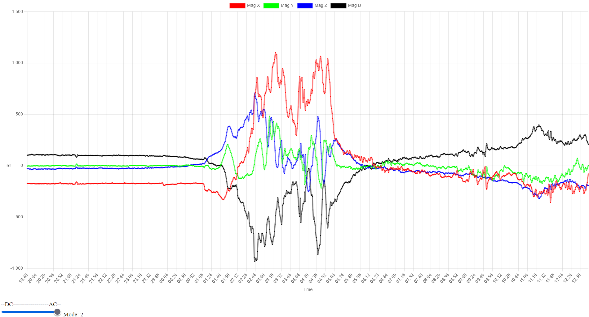
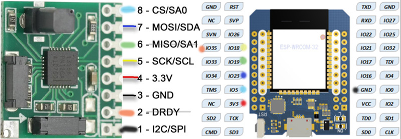

# **Space weather monitoring with RM3100 Magnetometer + WEMOS D1 MINI ESP32 running as a Webserver**



The earth magnetic field wobbles as the suns particle storms occasionally hits and gets trapped in the magnetic bubble surrounding the earth. These shifts in magnetic fields can be seen with sensitive sensors placed in not too disturbed places and can tell if aurora borealis is about to show up. Naturally these effects will be stronger the closer you get to the poles as well.
Designed to run on the ESP32 within the Arduino IDE framework.
```
    -----------
    |  ESP32  |  >30cm cable
    |         |
    |      5  |--------> RM3100 CS
    |      23 |--------> RM3100 MOSI
    |      19 |<-------- RM3100 MISO
    |      18 |--------> RM3100 SCLK
    |         |  3v3 <-> RM3100 VCC
    |         |  gnd <-> RM3100 GND
    |      35 |<-------- RM3100 DRDY
    |         |	 gnd <-> RM3100 SPI/I2C
    -----------
()_()
(^.^)
(ö.ö)
```
This project will run the RM3100 sensor in SPI mode on WEMOS D1 MINI ESP32 (Tried I2C mode but never got it run stable) Make sure to have some distance between the sensor, the ESP32 and if possible put the sensor in some plastic box and wrap it in some aluminum foil. Also keep the setup away from any magnetic materials like iron...

**Libs and versions**
Note that newer versions of libs might not work!!!
I used the Arduino 1.8.19 to make SPIFFS upload tool to work and upload the files in the data folder used by the webserver. I am not sure if it matters but I also used an old ESP32 lib from expressif V1.0.4
The following libraries needs to be installed to the "Arduino\libraries" folder
https://github.com/me-no-dev/ESPAsyncWebServer 3.1.0
https://github.com/me-no-dev/AsyncTCP 1.1.4
"WebSockets by Markus Sattler" 2.2.0
ArduinoJson benoit 6.21.5
Required to make SPIFFS.h work:
https://github.com/me-no-dev/arduino-esp32fs-plugin/releases/
https://randomnerdtutorials.com/install-esp32-filesystem-uploader-arduino-ide/

**Options**
The config.h file contains some options to configure things like WiFi SSID and PW. ESP 32 stores 1024 samples for each x, y & z vector sent periodically to the webserver ~60s. The RM3100 sample rate is set to ~36sps and averaging for 60 seconds keeping a data log for about 17h.
Once all is compiled and SPIFFS uploaded find a quite place away from other electrical or metallic object, Power up the ESP32 and connect to the webserver http://IP_address to view the magnetometer plots. You can choose between AC and DC mode. For space weather AC mode works the best.

Enjoy,
Walter
